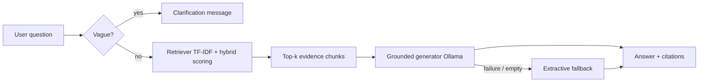

# Grounded Multi-Modal AI Analyst

Take-home submission: a **grounded** question-answering tool over your own files. Answers use **only retrieved evidence**, include **citations** (filename + page/section or sheet/row), and return **insufficient evidence** or **clarification** instead of guessing.

**Sample corpus:** 5 Markdown documents + 2 CSV tables under `data/sample/`.

**At a glance**

| Goal | Section |
|------|---------|
| Install Python deps + optional Ollama | [Quick start](#quick-start) |
| Ask one question from the terminal | [Run the CLI to ask one question](#run-the-cli-to-ask-one-question) |
| Run the eval set and read accuracy (`X/15`) | [Run the evaluation harness](#run-the-evaluation-harness) |
| Open the interactive web UI | [Run Streamlit](#run-streamlit) |

---

## Submission instructions (assessment §6)

The take-home **§6 Submission instructions** are met as follows.

| Instruction | How this repo satisfies it |
|---------------|----------------------------|
| **1. Organize your code in a clean directory structure** | Installable package under `src/grounded_analyst/`, sample data under `data/sample/`, evaluation assets under `eval/`, and project config at the root (`pyproject.toml`, optional `Dockerfile`, `.env.example`). See [Project layout](#project-layout). |
| **2. Include a README.md with setup steps** | [Quick start](#quick-start) (venv, install, optional Ollama), then [Run the CLI](#run-the-cli-to-ask-one-question), [Run the evaluation harness](#run-the-evaluation-harness), and [Run Streamlit](#run-streamlit). |
| **3. Architectural choices (why you chose specific libraries / models)** | [Architecture](#architecture) (pipeline and flow) and [Technology choices](#technology-choices) (library and model rationale in table form). |
| **4. A summary of your evaluation results** | [Evaluation results summary](#evaluation-results-summary): methodology, latest score, how to regenerate `eval/results.json`. |
| **5. Provide the evaluation set in a separate file *or* clearly within the documentation** | **Separate file:** [`eval/eval_set.json`](eval/eval_set.json) — 15 questions with `expected_answer_contains`. Described under [Evaluation results summary](#evaluation-results-summary) and used when you [run the evaluation harness](#run-the-evaluation-harness). |

**Suggested reviewer workflow (copy-paste)**

```bash
cd /path/to/labfox-AI   # repository root
python -m venv .venv && source .venv/bin/activate   # Windows: .venv\Scripts\activate
pip install -e .

# Recommended for scores matching the README summary:
ollama pull llama3.2:3b && ollama serve

# Terminal 2 — single question:
grounded-analyst ask --data-dir data/sample --question "What is the revenue for North in Q2-2025?"

# Terminal 2 — accuracy / eval harness:
grounded-analyst evaluate \
  --data-dir data/sample \
  --eval-file eval/eval_set.json \
  --out eval/results.json

# Terminal 2 — interactive UI:
streamlit run src/grounded_analyst/ui.py
```

---

## Quick start

### Prerequisites

- Python **3.10+**
- **[Ollama](https://ollama.com)** (recommended) with a small model, e.g. `llama3.2:3b`

### Install

```bash
python -m venv .venv
source .venv/bin/activate   # Windows: .venv\Scripts\activate
pip install -e .
```

### Configure Ollama (recommended)

```bash
ollama pull llama3.2:3b
ollama serve                  # if not already running
```

Optional overrides (copy from template):

```bash
cp .env.example .env
```

```env
OLLAMA_MODEL=llama3.2:3b
OLLAMA_URL=http://localhost:11434/api/generate
```

If Ollama is unreachable, the system still runs using **extractive grounded fallback** (verbatim excerpt + citation), not free-form hallucination.

---

## Run the CLI to ask one question

From the **repository root**, with the venv activated (`source .venv/bin/activate`):

```bash
grounded-analyst ask \
  --data-dir data/sample \
  --question "What is the revenue for North in Q2-2025?"
```

**Optional:** restrict retrieval to documents or tables only:

```bash
grounded-analyst ask \
  --data-dir data/sample \
  --question "What quarterly innovation budget was approved?" \
  --source-types document
```

Use comma-separated values for `--source-types`, e.g. `document`, `table`, or `document,table`.

---

## Run the evaluation harness

**Evaluation set file:** [`eval/eval_set.json`](eval/eval_set.json) — 15 questions; each row has `question` and `expected_answer_contains` (a substring the answer must include after normalization).

**Run the harness** (writes a JSON report and prints pass count):

```bash
grounded-analyst evaluate \
  --data-dir data/sample \
  --eval-file eval/eval_set.json \
  --out eval/results.json
```

**Read the score:** the terminal shows `Eval: X/15 passed`. Open **`eval/results.json`** for per-question `answer`, `citations`, `pass`, and `clarification_requested`.

**Pass rule:** substring match on the model answer vs. `expected_answer_contains` (case-insensitive; commas stripped; whitespace collapsed). Implemented in `evaluator.py`.

This is how you **measure accuracy** on the bundled questions: compare `passed` vs. `total` and inspect each row’s `pass` field in `eval/results.json`.

**Note:** With **`ollama serve`** and **`llama3.2:3b`** available, expect **15 / 15** on this corpus (see [Evaluation results summary](#evaluation-results-summary)). Without Ollama, extractive fallback may change wording slightly; re-run after starting Ollama if scores differ.

---

## Run Streamlit

From the **repository root**, with the venv activated and dependencies installed (`pip install -e .`):

```bash
streamlit run src/grounded_analyst/ui.py
```

Open the URL Streamlit prints (typically **`http://localhost:8501`**). Submit a question; the UI mirrors the same answer string as the CLI / eval JSON in expanders.

---

## Architecture

End-to-end flow:



**Layers**

1. **Ingestion** (`ingestion.py`): Unified evidence chunks from PDF, DOCX, Markdown/TXT, CSV/XLS(X). Tables become one chunk per row with locator `sheet …, row …`.
2. **Vague-question guard** (`vague_question.py`): Very short queries or queries without normal interrogative/task verbs get a **clarification** response—no retrieval, no fabricated answer.
3. **Retrieval** (`retrieval.py`): Lexical **TF-IDF** (`ngram_range=(1,3)`, English stop words) plus a **small hybrid score** (token overlap, numeric alignment, mild table hint). General-purpose—not tuned to named entities in the sample data.
4. **Grounding** (`grounding.py`): **Ollama** receives only retrieved chunks and a strict system prompt (explicit entities when asked “which/what”, no outside knowledge, insufficient-evidence phrase when unsupported). Optional **extractive fallback** preserves grounding if the LLM call fails.
5. **Orchestration** (`pipeline.py`): Ingest → retrieve → generate; structured **logging** with trace IDs (`logging_utils.py`).
6. **Evaluation** (`evaluator.py`): Runs predefined questions; substring match after light normalization (e.g. `10,000` vs `10000`).

**Design stance:** prioritize **correctness, citations, and safe refusal** over maximizing a brittle accuracy score. TF-IDF is intentionally simple and explainable; see [Limitations](#limitations-and-future-work).

---

## Technology choices

| Piece | Choice | Why |
|-------|--------|-----|
| Documents | `pypdf`, `python-docx` | Widely used, sufficient for text extraction in a small corpus |
| Tables | `pandas` + `openpyxl` | Robust CSV/Excel loading; rows become searchable text |
| Retrieval | `scikit-learn` TF-IDF | No API keys, fast, reproducible; good baseline before embeddings |
| Generation | Ollama + Llama-class model | Local, no hosted API quota; strict prompt for grounding |
| Config | `python-dotenv` | Non-secret defaults overridable via `.env` |
| UI | Streamlit | Minimal interactive demo for reviewers |
| Packaging | `pyproject.toml` + setuptools | Standard editable install |

---

## Evaluation results summary

- **Eval questions file:** [`eval/eval_set.json`](eval/eval_set.json) — 15 items (documents, tables, mixed, one *insufficient evidence* case).
- **Scoring:** each run must produce an answer containing the expected substring (see [Run the evaluation harness](#run-the-evaluation-harness)).
- **Representative run** (Ollama available with `llama3.2:3b`):

  - **Chunks indexed:** 21  
  - **Score:** **15 / 15** passed  
  - **Report artifact:** regenerate with `grounded-analyst evaluate ...` → `eval/results.json`

Inspect `eval/results.json` after a run for full details.

---

## Bonus features (nice-to-have)

Aligned with the assessment “bonus” list:

| Bonus | Status |
|-------|--------|
| **Advanced retrieval** | Hybrid TF-IDF scoring + optional `--source-types` metadata filter |
| **Table reasoning** | Row-level chunks + numeric alignment in retrieval and fallback (not full SQL-style aggregation) |
| **Interface** | Streamlit app (`ui.py`) |
| **DevOps / observability** | Structured logging + trace IDs in `pipeline.py`; optional **Docker** (below) |

### Docker (optional)

From the repo root:

```bash
docker build -t grounded-analyst .
docker run --rm -p 8501:8501 \
  -e OLLAMA_URL=http://host.docker.internal:11434/api/generate \
  grounded-analyst
```

Then open `http://localhost:8501`. Ollama must run on the host; adjust `OLLAMA_URL` on Linux if needed.

---

## Limitations and future work

- **Lexical retrieval** struggles with heavy paraphrasing or multi-hop reasoning unless wording overlaps the corpus.
- **Natural upgrades:** dense embeddings + reranker, query rewriting, stronger tabular aggregation over retrieved rows only.

---

## Project layout

```text
src/grounded_analyst/
  ingestion.py       # Load PDF / DOCX / MD / TXT / CSV / Excel → chunks
  retrieval.py       # TF-IDF index + hybrid scoring
  grounding.py       # Ollama prompt + extractive fallback + citations
  vague_question.py  # Underspecified query handling
  pipeline.py        # End-to-end orchestration + logging
  evaluator.py       # Eval harness
  cli.py             # ask | evaluate
  ui.py              # Streamlit
  logging_utils.py   # Structured logging helpers
  models.py          # Evidence / answer types
data/sample/         # Example corpus (docs + tables)
eval/
  eval_set.json      # 15 test questions + expected substrings
Dockerfile           # Optional UI container
.env.example         # Ollama overrides
```

---

## Core requirements mapping (quick reference)

Maps to the assessment **minimum expectations** (ingestion, retrieval, grounding, citations, fallback, eval set)—distinct from §6 submission packaging above.

- **Ingestion:** multi-format pipeline (`ingestion.py`).  
- **Retrieval:** unified index over all chunks (`retrieval.py`).  
- **Grounded generation:** evidence-only answers; Ollama + extractive fallback (`grounding.py`).  
- **Citations:** filename + locator on supported answers.  
- **Fallback:** insufficient evidence + clarification for vague queries.  
- **Evaluation set:** `eval/eval_set.json` + summarized results in [Evaluation results summary](#evaluation-results-summary).

---

## License / usage

Provided as a take-home submission artifact; adapt as needed for your employer or course policy.
